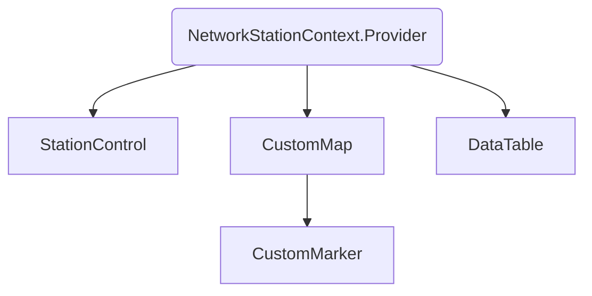
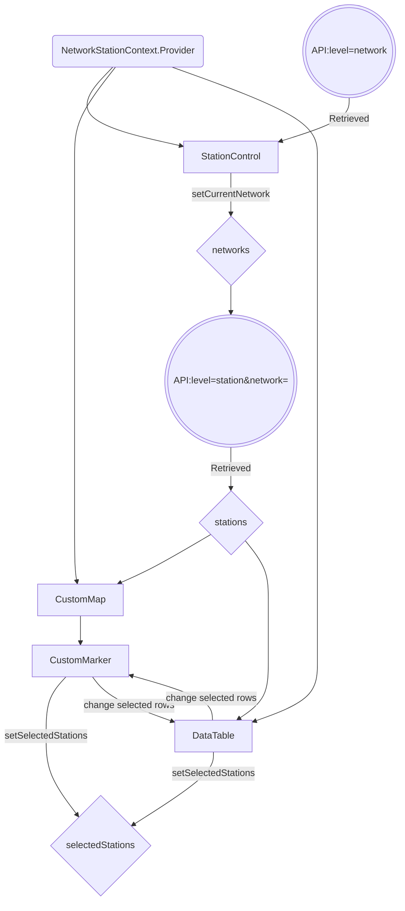

# GFZ coding challenge

This is an interactive map application.

Hosted with Vercel to [here](https://gfz-cgwnxw3n9-takahiromitsui.vercel.app/).

## Tech Stack

- Next.js 14
- TypeScript
- Tailwind CSS
- [shadcn/ui](https://ui.shadcn.com/docs/installation/next)

## Run Locally

Clone the project

```bash
  git clone https://github.com/takahiromitsui/GFZ.git
```

Install dependencies

```bash
  npm install
```

Start the development server

```bash
  npm run dev
```

## Structure

I utilised shadcn/ui for UIs.

There are four components.

- CustomMap
- CustomMarker
- DataTable
- StationControl

Plus, one context provider.

- NetworkStationContext.Provider



### Flow

- The NetworkStationContext.Provider provides context values to StationControl, CustomMap, and DataTable.

- StationControl can set the current network and retrieve stations from the API.
- CustomMap and DataTable both receive the list of stations from the context.
- CustomMarker can select stations, and changes to rowSelection by CustomMarker update the selected stations in DataTable.
- DataTable can change the selected stations and also updates CustomMarker through rowSelection.


